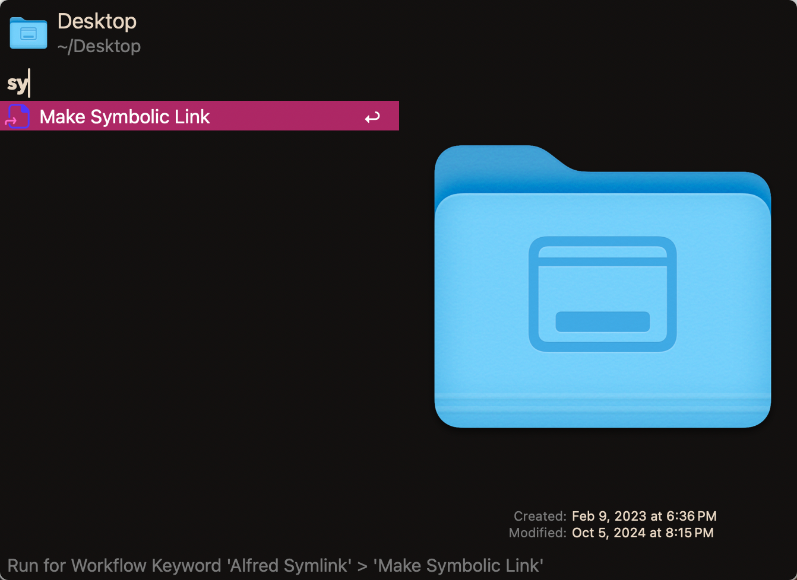

# Alfred Symbolic

> Make symlink for Alfred with ease

## Usage

Pick a folder in Alfred Search and right click to choose `Make Symbolic Link` to create a symbolic link in `QSpace Pro` or `Finder` current folder.

## License
This project is licensed under the MIT License. See [LICENSE](LICENSE) for details.
